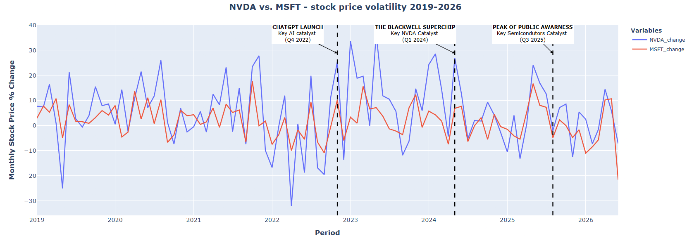
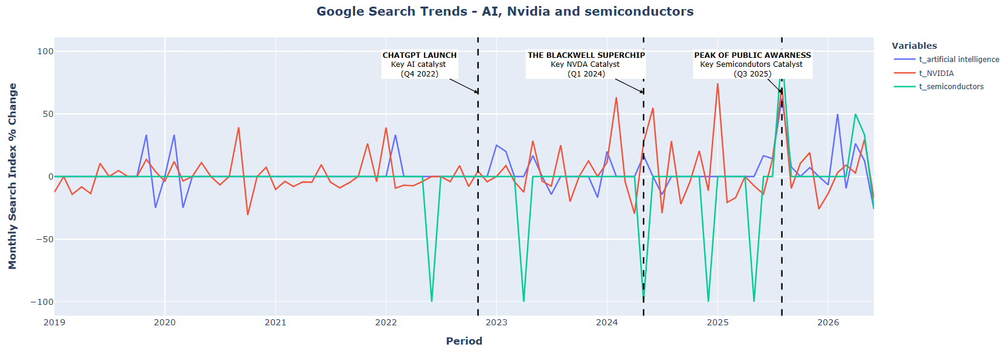
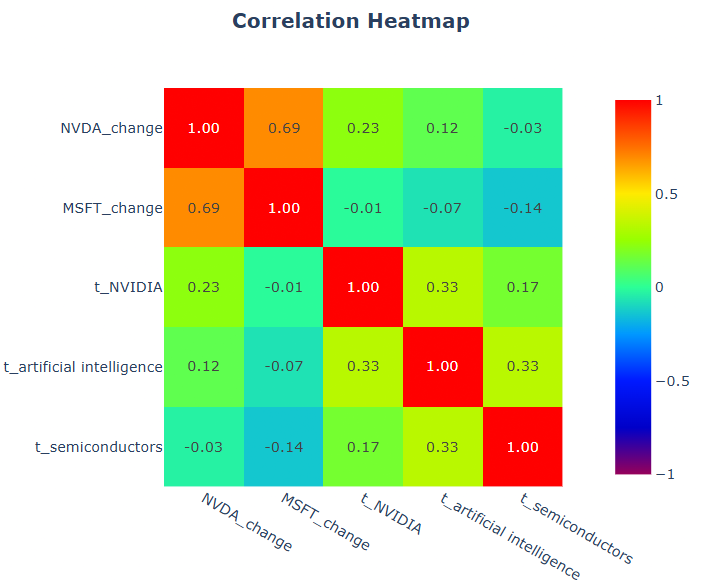
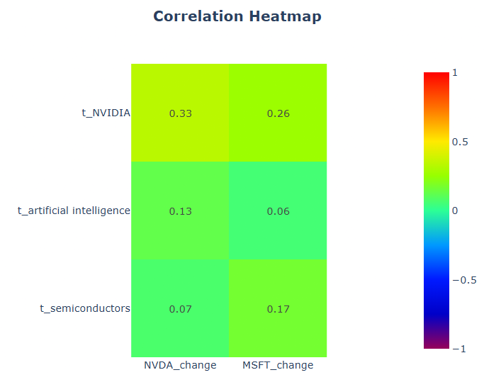

# AI Hype and NVIDIA Stock Performance Analysis

End-to-end data analysis project investigating the relationship between public interest in artificial intelligence and NVIDIA stock performance using Python, Yahoo Finance, and Google Trends.

---

## Project Overview

This project explores whether increasing public interest in artificial intelligence is associated with changes in NVIDIA's stock price.

The analysis combines historical financial market data from Yahoo Finance with Google Trends search interest data to evaluate correlations between market performance and AI-related search behaviour.

Microsoft stock was included as a benchmark to distinguish company-specific effects from broader market movements.

The project follows a complete analytical workflow:

Yahoo Finance + Google Trends → Data Validation → Data Preparation → Exploratory Analysis → Correlation Analysis → Lag Analysis → Business Conclusions

---

## Tech Stack

| Category | Technologies |
|----------|--------------|
| Programming Language | Python |
| Data Processing | Pandas, NumPy |
| Financial Data | yfinance |
| Search Trends | pytrends (Google Trends API) |
| Visualization | Plotly |
| Statistical Analysis | Correlation Analysis, Lag Analysis |

---

## Project Workflow

The analysis consists of six main stages.

### Data Collection

Historical datasets were collected from two independent sources:

- Yahoo Finance (daily stock prices)
- Google Trends (monthly search interest)

The project analyses:

- NVIDIA (NVDA)
- Microsoft (MSFT)
- Artificial Intelligence searches
- NVIDIA searches
- Semiconductor searches

---

### Data Quality Validation

Before analysis, all datasets were validated to ensure consistency.

The validation included:

- Missing value analysis
- Duplicate detection
- Dataset consistency checks
- Time range verification
- Frequency comparison between daily and monthly datasets

Special attention was given to incomplete reporting periods and differences in data granularity between financial markets and Google Trends.

---

### Data Preparation

Several preprocessing steps were required before combining the datasets.

These included:

- Resampling daily stock prices to a monthly frequency
- Percentage change calculations
- Dataset alignment
- Feature engineering
- Merging stock and search trend datasets

The final analytical dataset contains synchronised monthly observations suitable for correlation and time-series analysis.

---

### Exploratory Data Analysis

The exploratory analysis investigates:

- NVIDIA and Microsoft stock performance
- Stock price volatility
- AI-related search trends
- Search popularity over time
- Comparison between financial markets and public interest

This stage provides an overview of market dynamics before applying statistical analysis.




---

### Correlation Analysis

Pearson correlation analysis was performed to evaluate relationships between stock performance and search interest.

The analysis includes:

- Full-period correlation matrix
- Correlation after the launch of ChatGPT
- Comparison between NVIDIA and Microsoft
- Relationship between AI hype and stock performance



---

### Lag Analysis

To investigate potential delayed relationships, multiple lag analyses were performed.

The project evaluates:

- One-month lag
- Two-month lag
- Three-month lag

Both directions were analysed:

- Search trends leading stock prices
- Stock prices leading search trends

This approach helps identify whether public interest precedes market movements or whether increased market attention drives search behaviour.

---

## Key Findings

The analysis shows that:

- NVIDIA stock is significantly more volatile than Microsoft.
- AI-related searches increased rapidly after the launch of ChatGPT.
- Moderate positive correlations exist between AI search interest and NVIDIA stock performance.
- Stronger relationships appear when analysing the post-ChatGPT period.
- Lag analysis suggests that increased stock market attention may influence future search activity more than search trends predict future stock returns.

Two-Month Trends Lag Heatmap:



---

## Repository Structure

```text
ai-hype-vs-nvidia-stock-performance/
│
├── images/
│   ├── heatmap.png
│   ├── stocks.png
│   ├── trends.png
│   └── two_months_lag.png
│
├── AI_Hype_vs_NVIDIA_Stock_Performance.ipynb
│
└── README.md
```
